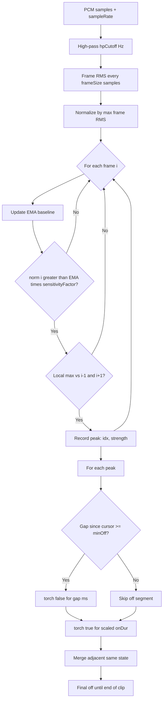

# LightShow Beats & Torch Timing — How It Works

This document explains how the Vixi LightShow determines **when to turn the phone flashlight on/off**, **for how long**, and **how audio is analyzed**.

---

## Upload-Time Audio Analysis (Detailed)

This section covers **only** what happens when a producer uploads an audio clip to build a custom program. All logic lives in `public/js/producer.js` (decode) and `public/js/torch-worker.js` (analysis).

**Where:** Producer UI → `public/js/producer.js` → Web Worker `public/js/torch-worker.js`  
**When:** Once, when the producer selects an audio file — **not** during live playback.

### Flow

```
Audio file
  → Web Audio decodeAudioData()
  → mono PCM samples + sampleRate
  → torch-worker.js (background thread)
  → [{ torch, duration }, ...]
  → saved to Firebase as customPrograms[name].effects
```

---

### Plain English: what the app measures

The app does **not** detect BPM, tempo, or song structure. It treats the clip as a stream of loudness over time and looks for **sudden spikes** that stand out above the recent background level.

1. **Filter out deep bass** so sub-bass rumble does not trigger flashes on every low note.
2. **Slice the song into tiny windows** (~11.6 ms each at 44.1 kHz) and measure how loud each window is.
3. **Scale loudness 0–1** relative to the loudest window in the entire clip.
4. **Track a moving “normal” loudness level** and flag windows that are noticeably louder *and* are a local peak (louder than the window before and after).
5. **Each flagged peak becomes a flash ON.** The time of the peak sets *when* the flash starts (rounded to the window boundary).
6. **Time between peaks becomes flash OFF** — but only if the gap is at least 30 ms. Shorter gaps skip the off state and can merge into one longer on burst.
7. **How long each flash stays on** depends on how strong that peak was: weak peak ≈ 20 ms, strong peak up to 120 ms.
8. **After the last peak**, the torch stays off until the end of the clip.

---

### Inputs (from the decoded audio file)

These come from the Web Audio API after the producer picks a file. They are **not** tunable in the UI.


| Variable     | Source                       | Role                                                                           |
| ------------ | ---------------------------- | ------------------------------------------------------------------------------ |
| `samples`    | `audioBuf.getChannelData(0)` | Raw PCM amplitude values for **left channel only** (`Float32Array`)            |
| `sampleRate` | `audioBuf.sampleRate`        | Samples per second (e.g. 44100, 48000). Affects time resolution of every frame |


**Not used:** right channel, metadata (title/BPM), frequency spectrum (FFT), or beat grid / tempo estimation.

**File size limit:** uploads over 500 MB are rejected in `saveClip()` before decode.

---

### Tunable options (parameters that control detection)

`producer.js` passes a subset of options into the worker. Anything not passed uses the **worker default** in `buildTimeline()`.


| Option              | Passed from `producer.js` | Worker default | What it controls                                                                                        |
| ------------------- | ------------------------- | -------------- | ------------------------------------------------------------------------------------------------------- |
| `frameSize`         | `512`                     | `512`          | Samples per analysis window. Smaller = finer timing, more CPU. At 44.1 kHz, 512 ≈ **11.6 ms** per frame |
| `hpCutoff`          | `400`                     | `400`          | High-pass cutoff in **Hz**. Energy below this is attenuated before loudness is measured                 |
| `sensitivityFactor` | `1.25`                    | `1.25`         | Multiplier on the dynamic threshold. **Lower** = more peaks detected; **higher** = fewer                |
| `minOff`            | `30`                      | `30`           | Minimum gap (ms) required to emit an **off** segment between peaks                                      |
| `minOn`             | `20`                      | `20`           | Minimum **on** duration (ms) for any detected peak                                                      |
| `maxOn`             | *(not passed)*            | `120`          | Maximum **on** duration (ms) for the strongest peaks                                                    |
| `alphaEMA`          | *(not passed)*            | `0.05`         | Smoothing factor for the moving-average “normal loudness” baseline (0.01–0.1)                           |


To change behavior today, edit the `options` object in `decodeAndSendToDSP()` in `producer.js`, or extend it to pass `maxOn` / `alphaEMA`.

---

### Pipeline stages and derived variables

#### Stage 1 — High-pass filter

**Function:** `highpass(samples, sr, hpCutoff)`


| Derived | Formula / meaning                                                               |
| ------- | ------------------------------------------------------------------------------- |
| `RC`    | `1 / (2π × hpCutoff)` — filter time constant                                    |
| `alpha` | `RC / (RC + 1/sr)` — single-pole high-pass coefficient                          |
| `hp[i]` | Filtered sample at index `i` — emphasizes mid/high transients, reduces sub-bass |


**Effect on on/off:** Lower `hpCutoff` (e.g. 300 Hz) lets more bass through → more peaks from kick drums. Higher cutoff → fewer bass-driven flashes, more snare/hi-hat driven.

---

#### Stage 2 — Frame RMS envelope

**Function:** `frameRMS(hp, frameSize)`

The filtered audio is split into non-overlapping frames of `frameSize` samples.


| Derived   | Formula / meaning                               |
| --------- | ----------------------------------------------- |
| `rms[i]`  | `sqrt(mean(sample²))` for frame `i`             |
| `maxE`    | `max(rms)` across the whole clip                |
| `norm[i]` | `rms[i] / maxE` — per-frame loudness in **0–1** |


**Effect on on/off:** `norm[i]` is the loudness signal used for all peak decisions. The clip is normalized to its own loudest moment, so quiet and loud masters behave similarly in relative terms.


| Derived      | Formula                                                                |
| ------------ | ---------------------------------------------------------------------- |
| `frameDurMs` | `(frameSize / sampleRate) × 1000` — real-time width of one frame in ms |


Peak **timing** is quantized to frame boundaries: peak at frame index `idx` → time `**tMs = idx × frameDurMs`**.

---

#### Stage 3 — Dynamic threshold and peak detection

**Loop:** for each frame `i` from `1` to `norm.length - 2`:


| Derived   | Formula / meaning                                                             |
| --------- | ----------------------------------------------------------------------------- |
| `ema`     | `alphaEMA × norm[i] + (1 - alphaEMA) × ema` — smoothed recent loudness        |
| `thr`     | `ema × sensitivityFactor` — threshold this frame must exceed                  |
| **Peak?** | `norm[i] > thr` **AND** `norm[i] >= norm[i-1]` **AND** `norm[i] >= norm[i+1]` |


If all three conditions pass, a peak is recorded:

```javascript
peaks.push({ idx: i, strength: norm[i] });
```


| Variable            | Role in on/off                                                                                                                       |
| ------------------- | ------------------------------------------------------------------------------------------------------------------------------------ |
| `idx`               | **When** to flash — converted to `tMs` (start of on segment, modulo merging rules below)                                             |
| `strength`          | **How long** to stay on — `norm[i]` at the peak (0–1) scales on-duration                                                             |
| `sensitivityFactor` | Higher threshold → fewer peaks → fewer flashes                                                                                       |
| `alphaEMA`          | Slower baseline (lower alpha) → threshold reacts slower → can miss fast quiet-loud-quiet hits; faster (higher alpha) → more reactive |


**What is NOT considered for peaks:** inter-peak interval, tempo, frequency bins, zero-crossings, or onset strength vs. previous peak.

---

#### Stage 4 — Build `{ torch, duration }` timeline

**State:** `cursorMs` tracks where the timeline ends in milliseconds (0 at start).

For **each peak** `{ idx, strength }`:

##### When is the torch OFF?

```javascript
const tMs    = idx * frameDurMs;      // peak time in ms
const offDur = tMs - cursorMs;        // gap since last timeline segment ended

if (offDur >= minOff) addSeg(false, offDur);
```


| Condition                  | Result                                                                  |
| -------------------------- | ----------------------------------------------------------------------- |
| `offDur >= minOff` (30 ms) | Emit `{ torch: false, duration: offDur }` — torch off for the gap       |
| `offDur < minOff`          | **No off segment** — gap is skipped; next on may merge with previous on |


So `**minOff**` is the main gate for whether silence/dim sections become explicit off periods. Short gaps (e.g. hi-hats 15 ms apart) tend to produce **back-to-back on segments** that get merged into one longer flash.

##### When is the torch ON?

Every detected peak always gets an on segment:

```javascript
const onDur = clamp(
  minOn + strength × (maxOn - minOn),
  minOn,
  maxOn
);
addSeg(true, onDur);
```


| Variable   | Effect on on-duration                                                    |
| ---------- | ------------------------------------------------------------------------ |
| `strength` | Primary driver: 0 → shortest flash, 1 → longest flash                    |
| `minOn`    | Floor (20 ms default) — even the weakest peak flashes at least this long |
| `maxOn`    | Ceiling (120 ms default) — strongest peaks cap here                      |


**Example values** (defaults `minOn=20`, `maxOn=120`):


| `strength` | `onDur` (ms) |
| ---------- | ------------ |
| 0.0        | 20           |
| 0.5        | 70           |
| 1.0        | 120          |


**Note:** On timing is tied to `cursorMs`, not directly to `tMs`, when the off segment was skipped. In that case the flash may start slightly **before** the detected peak time rather than exactly at `tMs`.

##### Segment merging

```javascript
// addSeg: if last segment has same torch state, add duration to it instead of new segment
if (last && last.torch === torch) last.duration += dur;
```

Adjacent `{ torch: true }` or `{ torch: false }` segments are combined into one longer segment.

##### Tail

```javascript
const totalMs = (samples.length / sampleRate) * 1000;
if (totalMs - cursorMs > 0) addSeg(false, totalMs - cursorMs);
```

After the last peak, remaining clip time is always **off** until the file ends.

---

### Summary: what determines ON vs OFF and duration


| Output field                     | Determined by                                                                |
| -------------------------------- | ---------------------------------------------------------------------------- |
| `**torch: true**`                | Frame `i` is a detected peak (above dynamic threshold + local maximum)       |
| `**torch: false**`               | Gap between peaks (if ≥ `minOff`), or tail after last peak                   |
| **Off duration**                 | `tMs - cursorMs` when gap ≥ `minOff`; else omitted/merged                    |
| **On duration**                  | `minOn + strength × (maxOn - minOn)`, clamped to `[minOn, maxOn]`            |
| **Peak timing (`tMs`)**          | `peak.idx × frameDurMs` where `frameDurMs = (frameSize / sampleRate) × 1000` |
| **Whether a peak exists at all** | `norm[i]`, `ema`, `sensitivityFactor`, `alphaEMA`, `hpCutoff`, `frameSize`   |


---

### Decision flow (diagram)




---

### Tuning guide


| If you see…                            | Try…                                                                                   |
| -------------------------------------- | -------------------------------------------------------------------------------------- |
| Too few flashes                        | Lower `sensitivityFactor` (e.g. 1.25 → 1.15) or lower `hpCutoff` (e.g. 300 Hz)         |
| Flashes on every hi-hat                | Raise `sensitivityFactor` or `minOff`; or increase `frameSize` to 1024                 |
| Flashes lag behind music (at playback) | Smaller `frameSize` (256/512); playback uses `setTimeout`, not re-analysis             |
| All flashes same length                | Peaks may have similar `strength`; widen `minOn`/`maxOn` spread or check normalization |
| Double-flash on single drum hit        | Lower `sensitivityFactor` or increase `minOff` so nearby frames don't both peak        |


---

### Code references

Producer decode and options (`public/js/producer.js`):

```javascript
const samples = audioBuf.getChannelData(0).slice();
torchWorker.postMessage({
  samples,
  sampleRate: audioBuf.sampleRate,
  options: {
    frameSize: 512,
    sensitivityFactor: 1.25,
    hpCutoff: 400,
    minOff: 30,
    minOn: 20
  }
}, [samples.buffer]);
```

Peak → segment logic (`public/js/torch-worker.js`):

```javascript
if (norm[i] > thr && norm[i] >= norm[i - 1] && norm[i] >= norm[i + 1]) {
  peaks.push({ idx: i, strength: norm[i] });
}

// ...
if (offDur >= minOff) addSeg(false, offDur);
const onDur = Math.max(minOn, Math.min(maxOn, minOn + strength * (maxOn - minOn)));
addSeg(true, onDur);
```

---

## Path B: Default Programs — Pre-authored Timelines

Default programs live in **Firebase** (`programs.default`), not in this repo. They use the same `{ torch, duration }` shape. When the producer clicks a default program button, `item.effects` is sent as the playlist — no audio analysis at runtime.

Special presets (`on`, `off`, `heartbeat`) follow the same playback pipeline; their effect data comes from Firebase rather than `torch-worker.js`.

---

## Playback Pipeline (Server → Phones)

### 1. Producer starts a program

The producer emits `play-program` over the socket with:

- `playlist: item.effects` (the `{ torch, duration }[]` array)
- `name: item.key`
- `startDateTime: Date.now()`

**File:** `public/js/producer.js`

### 2. Server builds an absolute timeline

`buildDJTimeline()` in `server/app.js` walks the playlist sequentially, assigning wall-clock `start` / `end` per segment and computing `loopDuration`:

```javascript
for (const effect of data.playlist) {
  const start = cursor;
  const end   = start + effect.duration;
  timeline.push({ ...effect, start, end });
  cursor = end;
  loopDuration += effect.duration;
}
```

Returns:

- `startTime` — absolute wall-clock anchor (ms)
- `timeline` — segments with absolute `start`/`end`
- `loop: true`
- `loopDuration` — total ms for one cycle

### 3. Broadcast to room

The server stores the timeline per token and emits `play` to all participants in that room. Late joiners receive the same timeline when they connect (`torch-connected` → `play` if `timelines[token]` exists).

### 4. User device executes (`timeline.js`)

**File:** `public/js/timeline.js`

- `onTimeline()` receives the play payload and normalizes segments to offsets within one loop
- `playFromCurrentPosition()` uses server time + client offset to find the current segment
- `setTimeout` schedules `applyEffect()` for each segment
- `applyEffect()` calls `setTorch(segment.torch)` via the camera API
- Program **loops** until the producer stops it

### Torch control (`camera-torch-access.js`)

```javascript
await track.applyConstraints({ advanced: [{ torch: !!on }] });
```

Uses the camera track's torch capability via `MediaStreamTrack.applyConstraints`.

### Android latency compensation

The client tracks how long `setTorch()` takes and keeps a running average (`torchDelay`) to partially compensate for hardware lag. Lead-ahead scheduling exists but is currently disabled (`getTorchLeadMs()` returns `0`).

---

## End-to-end Diagram

```mermaid
flowchart LR
  subgraph upload ["Upload time (Producer only)"]
    A[Audio file] --> B[Web Audio decode]
    B --> C[torch-worker.js]
    C --> D["Peaks → {torch, duration}[]"]
    D --> E[Firebase customPrograms]
  end

  subgraph live ["Show time (All phones)"]
    F[Producer clicks program] --> G[play-program socket]
    G --> H[buildDJTimeline on server]
    H --> I[play event to room]
    I --> J[timeline.js on each phone]
    J --> K[setTorch on/off on schedule]
  end

  E --> F
```




---

## Key Files


| File                               | Role                                                   |
| ---------------------------------- | ------------------------------------------------------ |
| `public/js/torch-worker.js`        | Beat detection DSP; builds `{ torch, duration }[]`     |
| `public/js/producer.js`            | Audio upload, decode, worker dispatch, program save    |
| `server/app.js`                    | `buildDJTimeline()`, `play-program` handler, broadcast |
| `public/js/timeline.js`            | Client-side scheduled playback and looping             |
| `public/js/camera-torch-access.js` | Camera/torch API wrapper                               |
| `public/js/user.js`                | Receives `play` socket event, calls `onTimeline()`     |


---

## FAQ


| Question                                | Answer                                                                                                                |
| --------------------------------------- | --------------------------------------------------------------------------------------------------------------------- |
| Is audio analyzed live during the show? | **No.** Analysis happens at upload when building custom programs.                                                     |
| What does the participant mic do?       | Recording (if enabled), not beat detection.                                                                           |
| What counts as a "beat"?                | A frame whose RMS energy is a local maximum above a dynamic EMA threshold (after high-pass), not BPM/tempo detection. |
| How is sync handled?                    | Server `startTime` + client clock offset; `setTimeout` per segment; programs loop.                                    |
| On/Off/Heartbeat?                       | Same pipeline; effects come from Firebase presets rather than `torch-worker.js`.                                      |


---

## One-sentence Summaries

**Layperson:** The app listens to a song once, marks the punchy moments, saves a flash script, and every phone runs that script together when the producer hits play.

**Dev:** Offline onset detection (high-pass → frame RMS → adaptive threshold peak picking) produces a `{torch, duration}` playlist; the server stamps absolute timestamps and clients loop-schedule `track.applyConstraints({ torch })` against wall-clock sync — no runtime audio analysis on participants.